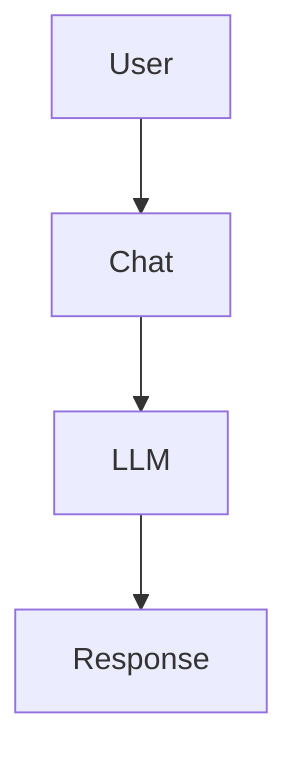

# XMarkdown Usage Guide

The `XMarkdownRenderer` component provides comprehensive markdown rendering with support for Mermaid diagrams, custom HTML components, and data charts.

## Features

### 1. GitHub Flavored Markdown (GFM)
All standard markdown features work out of the box:
- **Bold**, *italic*, `inline code`
- [Links](https://example.com)
- Tables
- Task lists
- Code blocks with syntax highlighting

### 2. Mermaid Diagrams

Mermaid diagrams are automatically rendered when wrapped in fenced code blocks:

````markdown

````

Supported diagram types:
- `flowchart` (graph TD/LR)
- `sequenceDiagram`
- `classDiagram`
- `stateDiagram-v2`
- `erDiagram`
- `gantt`
- `pie`
- `gitgraph`

### 3. Custom HTML Components

You can embed custom React components directly in markdown using HTML-like tags:

```markdown
<welcome
  data-icon="https://example.com/icon.png"
  title="Hello, I'm your AI Assistant"
  data-description="I can help you with various tasks"
></welcome>
```

#### Creating Custom Components

```tsx
import { WelcomeCard } from '@hsafa/ui-sdk/markdown-examples/WelcomeCard';

<XMarkdownRenderer
  content={markdown}
  customComponents={{
    welcome: WelcomeCard,
    'user-card': UserCard,
    // ... more custom components
  }}
/>
```

Component props:
- `domNode` - Parsed HTML node with `attribs` (attributes)
- `streamStatus` - 'loading' | 'done' (for streaming awareness)
- Standard HTML attributes

### 4. Data Charts

Embed chart specifications directly in markdown:

```markdown
<data-chart
  data-source="sales_2024"
  data-spec='{
    "type": "line",
    "x": "date",
    "y": "revenue",
    "smooth": true
  }'
></data-chart>
```

The DataChart component:
- Shows loading skeleton during streaming
- Parses JSON spec when complete
- Can be integrated with any charting library (ECharts, AntV, Chart.js, etc.)

## Streaming Support

XMarkdownRenderer is optimized for LLM streaming:

```tsx
const [content, setContent] = useState('');
const [isStreaming, setIsStreaming] = useState(true);

// As chunks arrive from LLM
stream.on('chunk', (chunk) => {
  setContent(prev => prev + chunk);
});

stream.on('end', () => {
  setIsStreaming(false);
});

return (
  <XMarkdownRenderer
    content={content}
    streaming={isStreaming}
  />
);
```

Features during streaming:
- Progressive rendering with fade-in animation
- Skeleton placeholders for incomplete components
- Automatic finalization when streaming completes

## Complete Example

```tsx
import { XMarkdownRenderer } from '@hsafa/ui-sdk';
import { WelcomeCard } from '@hsafa/ui-sdk/markdown-examples/WelcomeCard';

const markdown = `
# System Architecture

Here's how our system works:

\`\`\`mermaid
sequenceDiagram
    User->>WebApp: HTTP request
    WebApp->>API: REST call
    API->>DB: Query
    DB-->>API: Result
    API-->>WebApp: JSON response
    WebApp-->>User: Rendered page
\`\`\`

<welcome
  data-icon="/logo.png"
  title="Welcome to Our Platform"
  data-description="Built with modern technology"
></welcome>

## Sales Data

<data-chart
  data-source="sales_last_7_days"
  data-spec='{
    "type": "bar",
    "x": "date",
    "y": "revenue"
  }'
></data-chart>
`;

export function ChatMessage({ isStreaming }: { isStreaming: boolean }) {
  return (
    <XMarkdownRenderer
      content={markdown}
      theme="dark"
      streaming={isStreaming}
      customComponents={{
        welcome: WelcomeCard,
      }}
    />
  );
}
```

## Security

XMarkdownRenderer uses DOMPurify for HTML sanitization:
- No `dangerouslySetInnerHTML`
- XSS protection by default
- Configurable allowed tags and attributes
- Safe for rendering LLM-generated content

## Prompting LLMs

To get LLMs to use these features, include instructions like:

```
MARKDOWN & DIAGRAM CAPABILITIES:
Your responses are rendered with @ant-design/x-markdown, which supports:
- GitHub Flavored Markdown (GFM): tables, task lists, strikethrough, autolinks
- Mermaid diagrams: Use when visuals aid clarity (schemas, flows, architectures)
- Custom components: <welcome>, <data-chart>, etc.
- Streaming support: Your responses render progressively

For Mermaid diagrams, wrap them in fenced code blocks with "mermaid" language tag.
For charts, use <data-chart data-source="..." data-spec='{...}'></data-chart>
```
