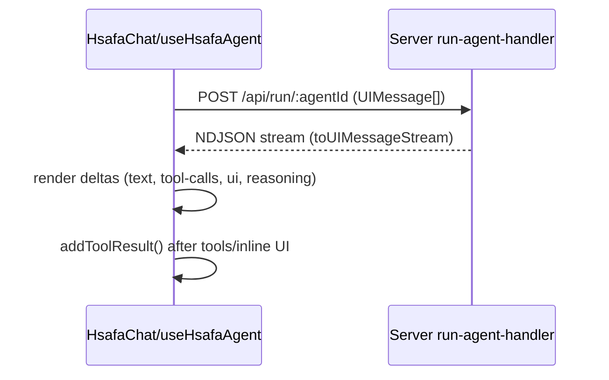

# 02 — Architecture

This section explains how the SDK layers fit together across UI, hooks, storage, transport, and the server runtime.

## Layers

- **Provider**: `sdk/src/providers/HsafaProvider.tsx`
  - Holds SDK config (`baseUrl`, `dir`, `theme`).
  - Tracks per-chat streaming/open state.
- **Chat UI**: `sdk/src/components/HsafaChat.tsx`
  - Vercel AI SDK v5 `useChat` based.
  - Integrates tools (`HsafaTools`) and renderable UI components (`HsafaUI`), plus inline form rendering for `requestInput`.
  - Persists chat history via `createChatStorage()` and `useChatStorage()`.
- **Headless Agent**: `sdk/src/hooks/useHsafaAgent.ts`
  - Same semantics as `HsafaChat` without UI.
  - Exposes `messages`, `sendMessage()`, `stop()`, `chatId`, `setChatId()`, tool/UI plumbing, and form handling.
- **Storage**: `sdk/src/hooks/useChatStorage.ts`, `sdk/src/utils/chat-storage.ts`
  - LocalStorage-based persistence per `agentId`.
- **Transport**: `sdk/src/components/hsafa-chat/utils/transport.ts`
  - `createHsafaTransport(baseUrl, agentId, chatId)` wraps `DefaultChatTransport` and injects `chatId`.
- **Tools & UI**: `sdk/src/components/hsafa-chat/utils/`
  - Built-in browser tools (cursor control, DOM discovery, fill input) and inline form renderer for `requestInput`.

## Data contracts

- **Client → Server**: UI messages via Vercel AI SDK v5 `useChat()`.
  - The SDK posts to `POST {baseUrl}/api/run/:agentId` with body `{ messages: UIMessage[], chatId, ... }`.
- **Server → Client**: NDJSON stream created by `createUIMessageStreamResponse()`.
  - Contains deltas for text, tool calls/results, reasoning, and final response items.

## Message flow

## Tool execution

- **Frontend tools**: provided as functions in `HsafaTools` (or `tools` for headless). Executed inside `onToolCall` when the tool name matches.
- **UI tools**: the agent can request `ui` or a registered component name. Rendering is deferred; result posted with `addToolResult()` on success/error.
- **Request input**: special tool that renders a form inside a message using `renderUserForm.ts` and waits for user.

## Persistence model

Storage keys (from `createChatStorage()`):
- Index: `hsafaChat_${agentId}.chats`
- Chat data: `hsafaChat_${agentId}.chat.${chatId}`
- Current chat id: `hsafaChat_${agentId}.currentChatId`
- Show chat: `hsafaChat_${agentId}.showChat`

## Server architecture (overview)

- `server/src/modules/agents/run-agent-handler.ts`:
  - Loads agent config (nodes/edges) from Prisma.
  - Builds model/tool stack (including MCP) via `run-core/*`.
  - Converts `UIMessage[]` to model messages (`convertToModelMessages`).
  - Streams via `streamText(...).toUIMessageStream()` and returns `createUIMessageStreamResponse()`.
- `run-core/` includes:
  - `models.ts` (provider factories),
  - `mcp.ts` (MCP runtime),
  - `tools/` (HTTP, web_control, etc.),
  - `prompts.ts` (system prompt construction).
